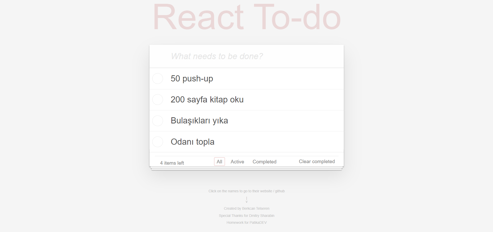

# React To-Do List

React ile yapmış olduğum basit bir To-do websitesi.

Local Storage kullanılmıştır. Böylece siteyi her yenilediğimizde görevlerimizi tekrar tekrar yazmamız gerekmiyor.

*CSS ve HTML dmitrysharabin'den alınmıştır. Amaç elimizdekileri kullanarak siteye react bilgimizi aktarmak ve siteyi fonksiyonel hâle getirmek.*
